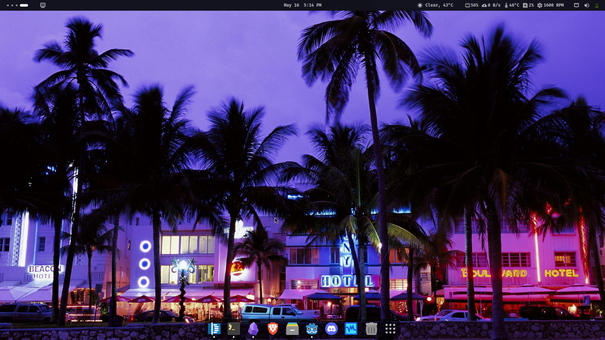
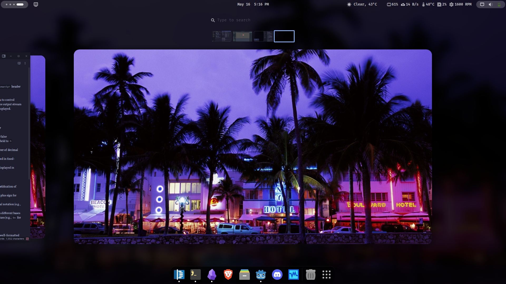
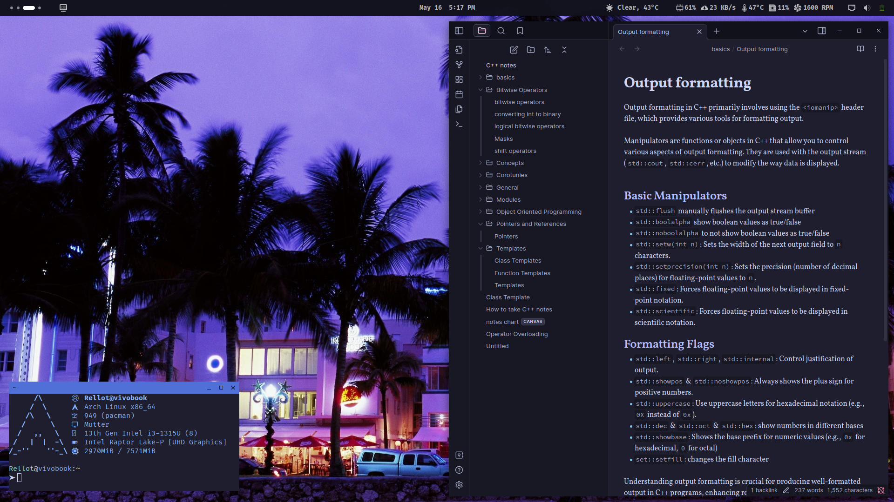
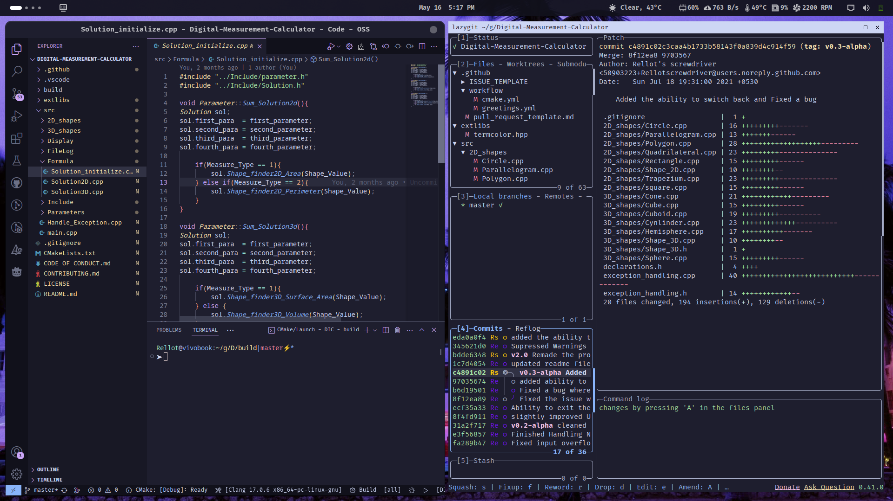
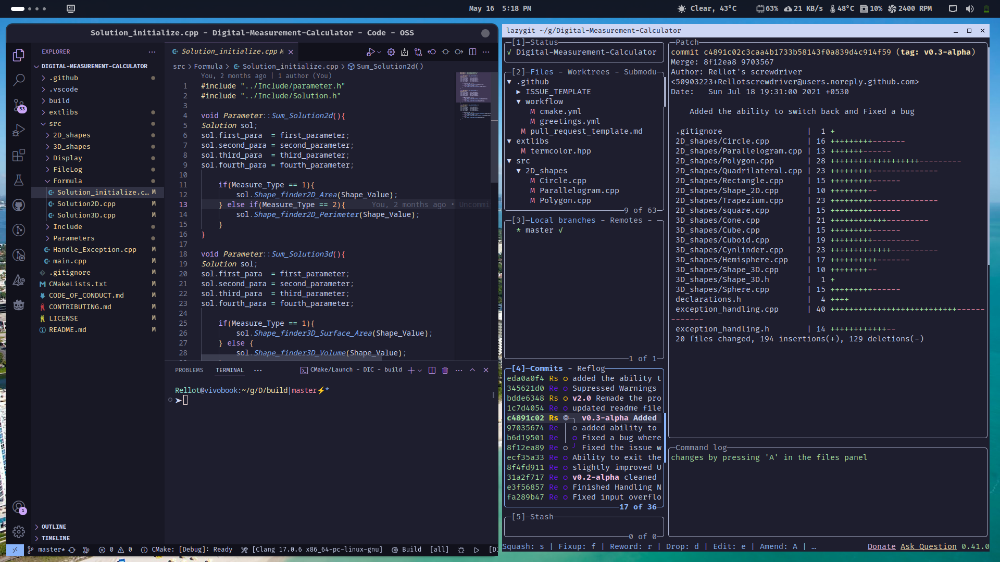

# periodfiles/Configuration files
This is my personal dotfiles repository. 

## How to install and set up my dotfiles?

- clone this repository in your preferred folder
- run install.sh to install it in your configuration folder
- install gnome-tweaks and gnome-extensions-settings
- install gnome extensions like
    - vitals: https://extensions.gnome.org/extension/1460/vitals/
    - topbar organizer: https://extensions.gnome.org/extension/4356/top-bar-organizer/
    - tiliing assistant: https://extensions.gnome.org/extension/3733/tiling-assistant/
    - random wallpaper: https://extensions.gnome.org/extension/1040/random-wallpaper/
    - openweather refined: https://extensions.gnome.org/extension/6655/openweather/
    - just perfection: https://extensions.gnome.org/extension/3843/just-perfection/
    - dash to dock: https://extensions.gnome.org/extension/307/dash-to-dock/
    - blur my shell: https://extensions.gnome.org/extension/3193/blur-my-shell/
    - enable auto move windows
- restart and enjoy!

## Screenshots
here are the screenshots as I believe people like to see previews of the repo before downloading it

click here to see the screenshots

**DE:** Gnome + Catppuccin

<video width="1920" height="1080" controls>
    <source src="screenshots/catgnomevideo.mp4" type="video/mp4">
</video>

the wallpaper in each screenshot can be found in **wallpapers** directory

Before leaving out, don't forget to **STAR** this repository! Thanks for checking out. *see ya bois and ladies*