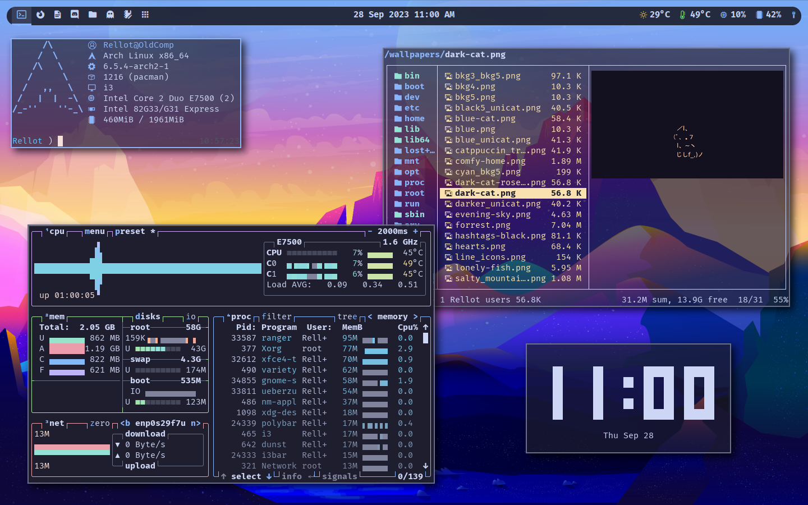
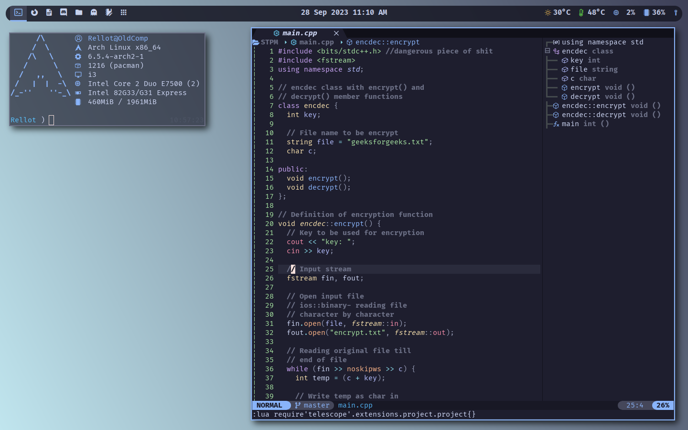
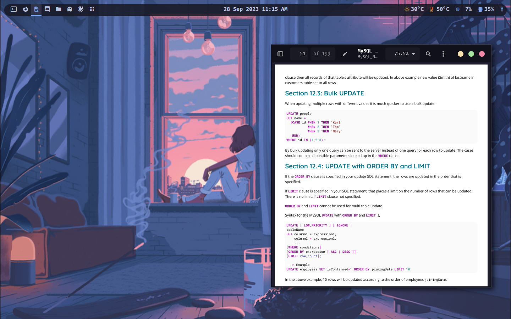
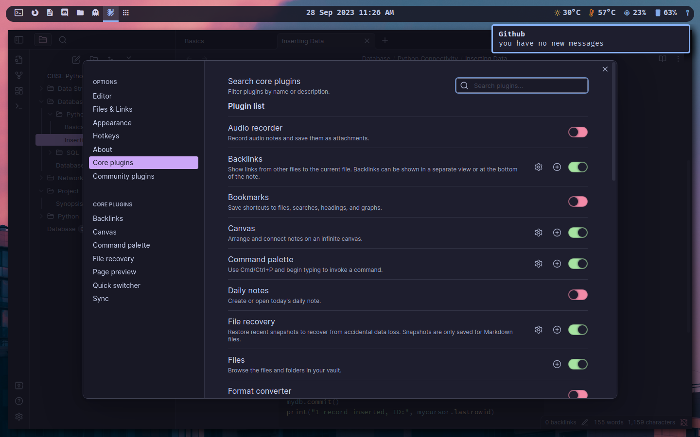
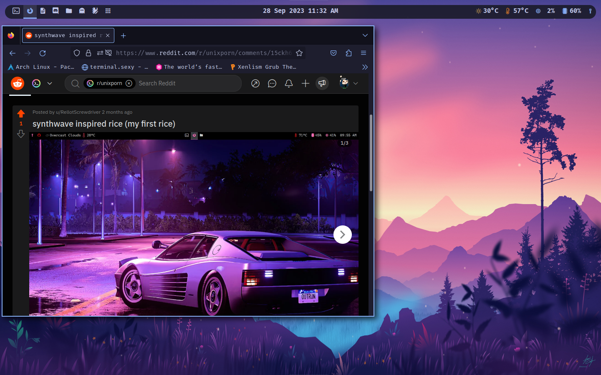
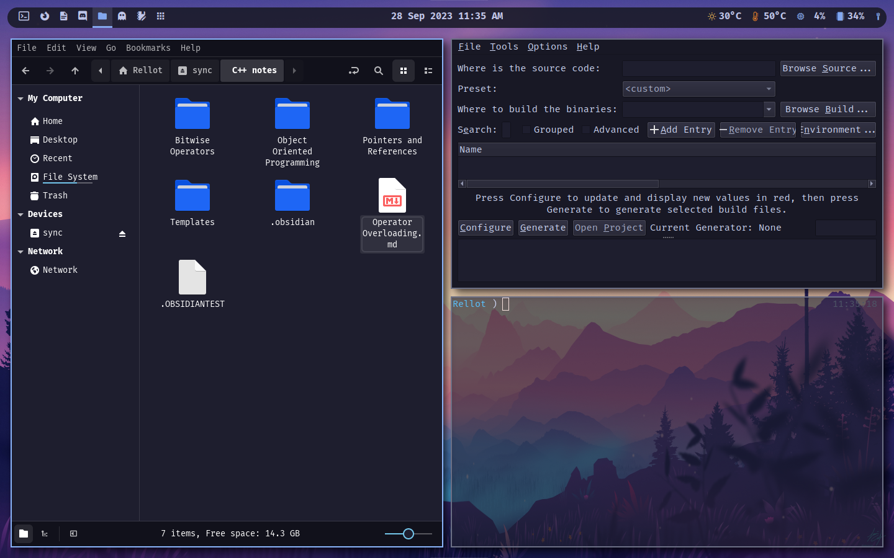
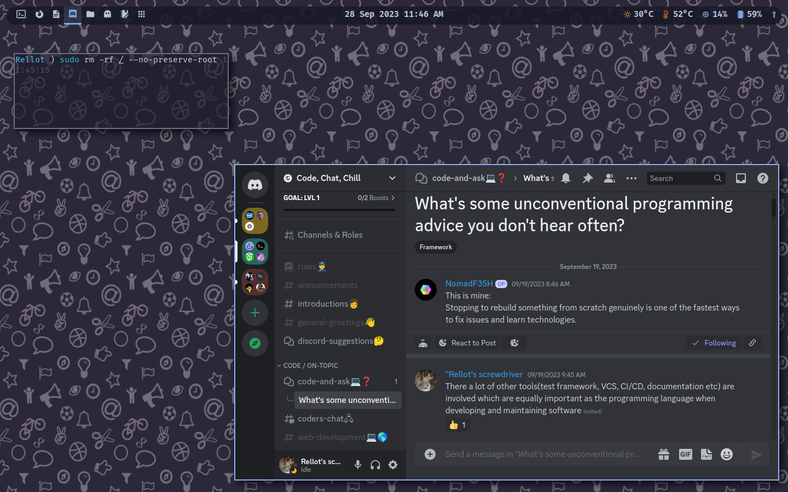
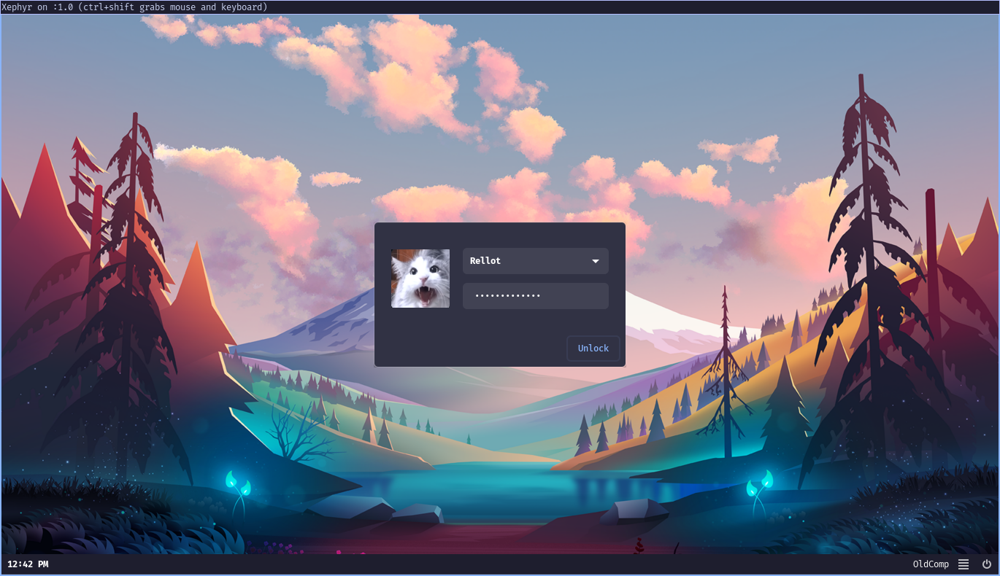

# periodfiles/Configuration files
This is my personal dotfiles repository. 

## How to install and set up my dotfiles?

- clone this repository in your preferred folder
- run install.sh to install it in your configuration folder
- restart and enjoy!

## Screenshots
here are the screenshots as I believe people like to see previews of the repo before downloading it

click here to see the screenshots

**WM:** i3, polybar(top), ranger(left), btop++(bottom left), peaclock(bottom right)

neofetch and neovim

evince

obsidian and dunst

firefox

nemo(left), cmake(top right)

discord(bottom right)

lightdm GTK greeter

the wallpaper in each screenshot can be found in **wallpapers** directory

Before leaving out, don't forget to **STAR** this repository! Thanks for checking out. *credits rolling*

## credits
- https://github.com/SunoBB/dot
- https://github.com/HoNamDuong/.dotfiles
- https://github.com/kritdass/dotfiles
- https://github.com/zoddDev/dotfiles
- https://github.com/folke/dot
- https://github.com/skbolton/titan
- https://github.com/Hamza12700/DotFiles
- https://github.com/CaoHoangKiet222/ArchLinux
- https://github.com/nimishgo/i3wm-themes
- https://github.com/loctvl842/nvim
- https://github.com/KiteAB/.config
- https://github.com/theniceboy/.config
- https://github.com/ericmurphyxyz/dotfiles
- https://github.com/reedrw/dotfiles
- https://github.com/iamsubhranil/Rice
- https://github.com/bookercodes/dotfiles
- https://github.com/catppuccin/polybar
- https://github.com/polybar/polybar-scripts
- https://github.com/Fxzzi/.dots
- https://github.com/anishathalye/dotbot
- https://github.com/nocturnal84/dotfiles
- https://github.com/sbulav/dotfiles
- https://github.com/heapbytes/dotfiles
