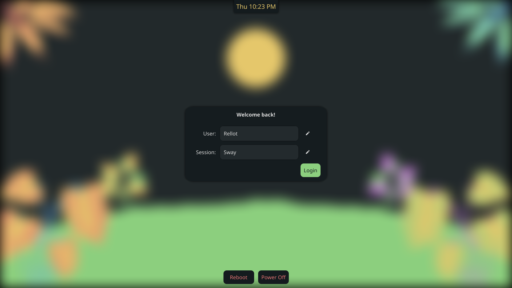
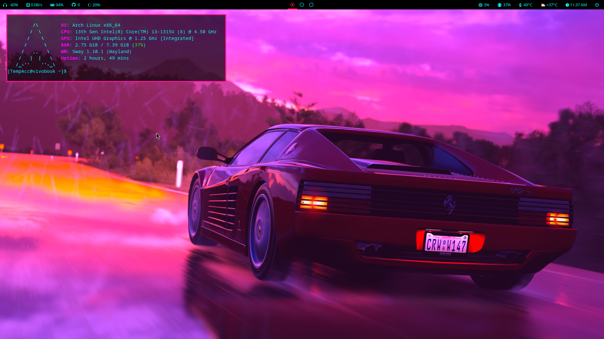
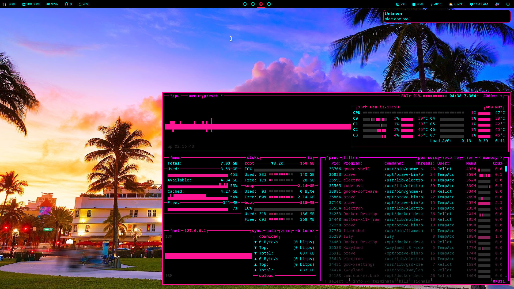
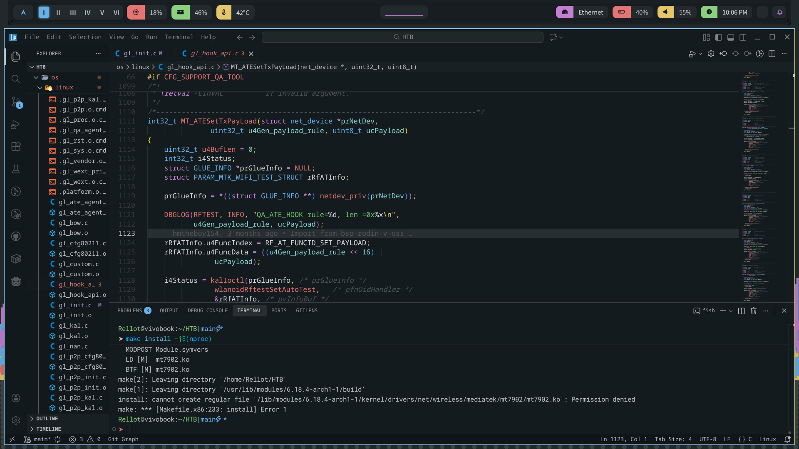
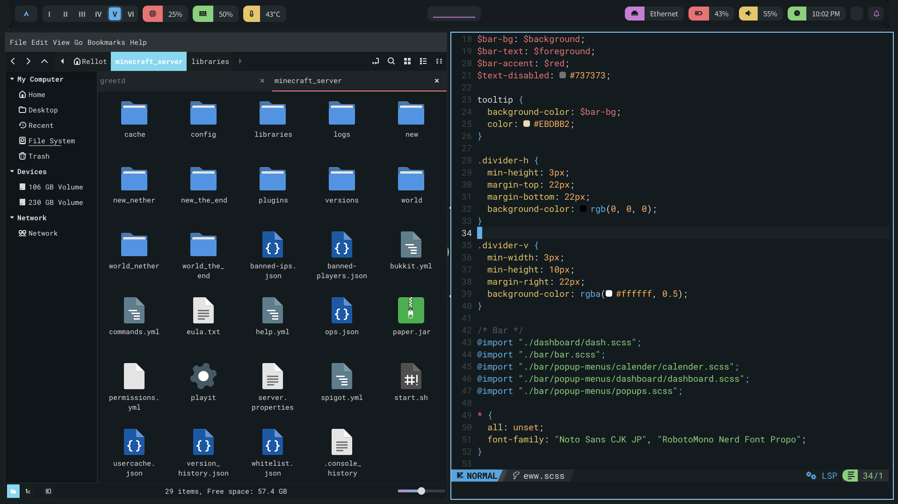
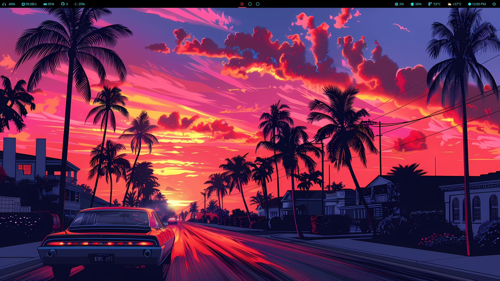
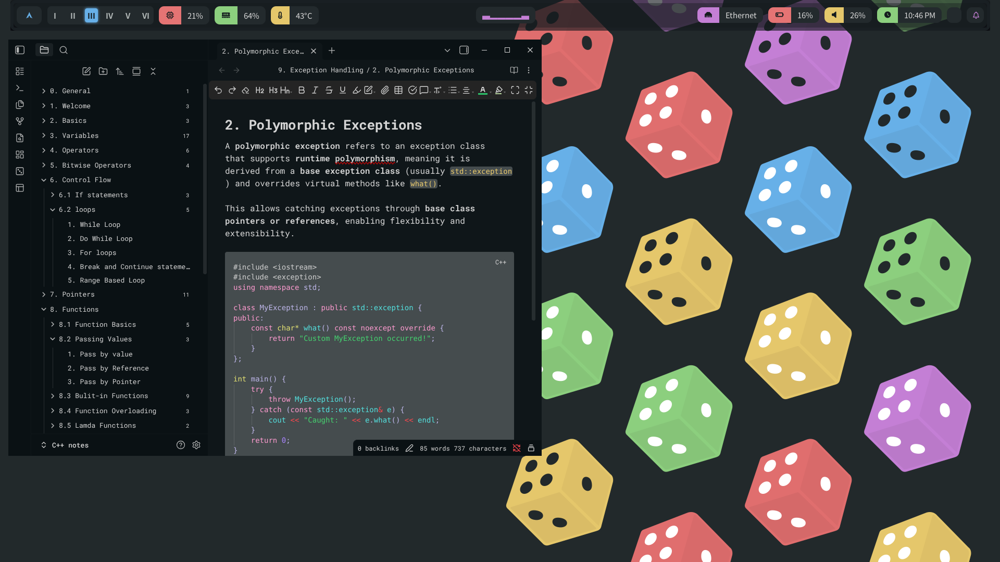
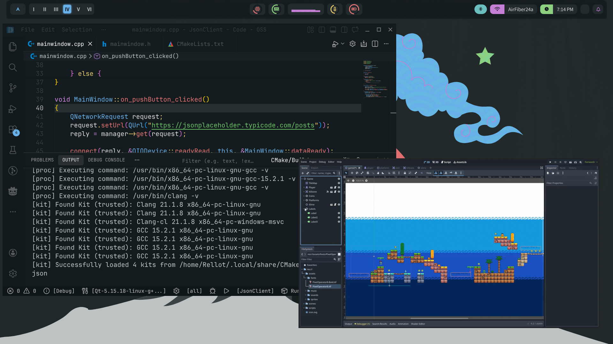
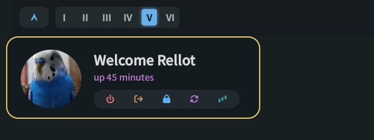
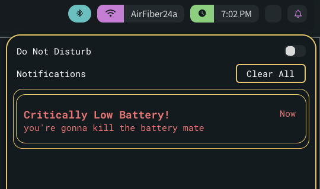

# ✨ My workstation ✨
This is my personal dotfiles repository. The theme name is everblush.

this will my final rice before I change it for multi-monitor setup, 
small incremental changes will be done

## ❓ What are dotfiles?

Dotfiles are the customization files that are used to personalize your Linux or other Unix-based system. they are configurations for various applications. 

This repository contains my personal dotfiles. They are stored here for convenience so that I may quickly access them on new machines or new installs. Also, others may find some of my configurations helpful in customizing their own dotfiles. This config uses `sway` window manager.


## 📦 How to install and set up my dotfiles?

my install script isn't perfect so only execute this if you know what you're doing,
this script only works if you're on arch linux!
- install dependencies from `dependencies.txt` file
- Clone this repository
- run `sh install.sh`
- disable your current login manager and then enable greetd by ```sudo systemctl enable greetd.service```
- restart and enjoy!

## 🎹 Shortcut keys

here mod key is the windows key(the one with Windows logo) rest are same as default. 
since sway mostly uses shortcut keys from i3(which I love it's ease of use and keys making sense) 

`$mod + x` toggles dashboard

`$mod + p` toggles powermenu

`$mod + z` toggles bar

`$mod + g` kill eww daemon(if it crashes or spawns a zombie process)

`$mod + d` opens application launcher

`$mod + n` opens obsidian

## 📸 Screenshots
here are the screenshots as I believe people like to see previews of the repo before downloading it

<details>
<summary>Greeter in Regreet</summary>

</details>

<details>
<summary>eww</summary>

</details>

<details>
<summary>fastfetch & btop & ranger</summary>

</details>

<details>
<summary>Qt Creator</summary>

</details>

<details>
<summary>Nemo & Neovim(no rhyme intended)</summary>

</details>

<details>
<summary>Godot</summary>

</details>

<details>
<summary>obsidian</summary>

</details>

<details>
<summary>Code - OSS(alternative of VScode) and mpv(with modernZ config)</summary>

</details>

<details>
<summary>eww powermenu</summary>

</details>

<details>
<summary>swaync</summary>

</details>

<br>

the wallpaper of each screenshot can be found in **wallpapers** directory

Before leaving out, don't forget to **STAR** this repository! Thanks for checking out. 

***credits rolling***

## 🙏 Credits
- https://github.com/randomboi404/eww - main inspiration
- https://github.com/Firstp1ck/Hyprland-Simple-Setup
- https://github.com/mehedirm6244/Miserable_Xfce
- https://github.com/syndrizzle/hotfiles/tree/worm
- https://github.com/AlphaTechnolog/dotfiles/tree/openbox
- https://github.com/zDyant/HyprNova
